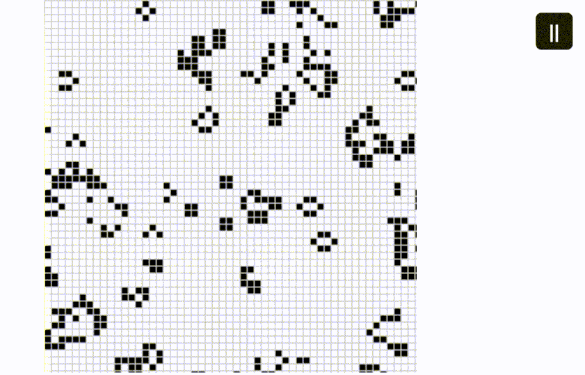

# 🧬 Conway's Game of Life - Rust + WebAssembly Edition

[](https://www.rust-lang.org/)
[](https://webassembly.org/)

**implementing [Conway's Game of Life](https://en.wikipedia.org/wiki/Conway%27s_Game_of_Life)**  
🦀 Rust + 🕸 Wasm = ❤

## Preview https://fahdfady.github.io/wasm-game-of-rust/

  

## ✨ Features
- **Rules**: Loyal implementation of Conway's original rules
- **Pause/Resume**: Control simulation with a play/pause button
- **Interactive Grid**: Click cells to toggle their state
- **Random Initialization**: Start with _chaotic_ patterns

## 🎮 Game Rules
1. **Underpopulation**: Live cell with <2 neighbors dies
2. **Survival**: Live cell with 2-3 neighbors lives
3. **Overpopulation**: Live cell with >3 neighbors dies
4. **Reproduction**: Dead cell with exactly 3 neighbors becomes alive

## 🚀 Getting Started

### run it yourself:

#### Prerequisites
- [Rust](https://www.rust-lang.org/tools/install)
- [wasm-pack](https://rustwasm.github.io/wasm-pack/installer/)
- [Node.js](https://nodejs.org/) & npm

#### Installation
```bash
git clone https://github.com/fahdfady/wasm-game-of-rust.git
cd wasm-game-of-rust
cd www
npm install
npm run wasm
npm run dev